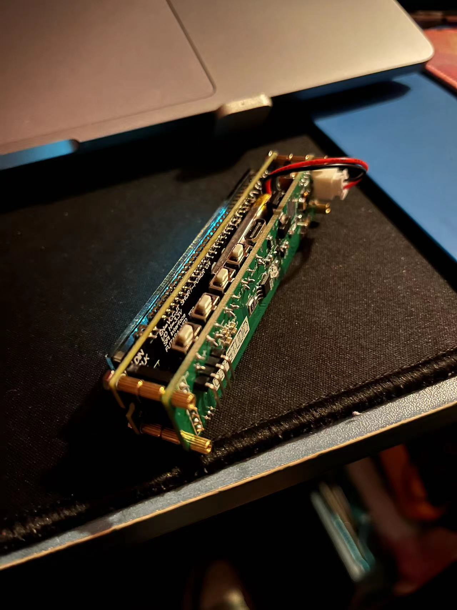

# ST-VFD-MC
### VFD桌面时钟摆件 迷你荧光屏时钟 DIY

STM32F103 个性化桌面VFD时钟驱动

驱动板是自己画的，VFD屏幕模块带字符芯片是TB买的。

#### 功能 
1. 年月日时分秒的基本显示，且具有闰年补偿，支持断电走时，备用3.7v纽扣电池提供掉电走时的能源支持。
2. 自带3.7v锂电池，可通过typec口充电，具有充电指示灯。
3. 具有温度传感器可屏显温度信息。
4. 具有串口芯片可链接电脑进行通讯
5. 四个按键，可设置时分秒年月日走时，切换显示内容:日期、时间、温度。 屏幕亮度分三个等级低中高调整
6. 可设置开关自动轮播切换显示内容。
7. 板载TypeC口可串口连接电脑做二次开发。

---

原理图和PCB可联系我获取，另外小黄鱼有售卖成品。

**联系邮箱： yustart@foxmail.com**
**QQ交流群： 676436122**
